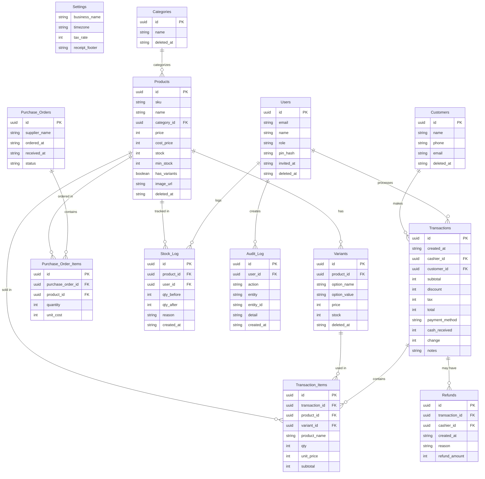

# Technical Requirements Document (TRD)
# POS UMKM — Point of Sale for Indonesian Small Businesses

| Field       | Detail                            |
|-------------|-----------------------------------|
| Version     | 2.1                               |
| Status      | Draft                             |
| Date        | April 2026                        |
| Related     | docs/PRD.md (Product Requirements)     |

---

## Table of Contents

1. [Platform & Architecture](#1-platform--architecture)
2. [Frontend](#2-frontend)
3. [Authentication — Google Login](#3-authentication--google-login)
4. [Data Layer — Google Sheets](#4-data-layer--google-sheets)
5. [Entity Relationship Diagram](#5-entity-relationship-diagram)
6. [Data Security](#6-data-security)
7. [Testing Strategy](#7-testing-strategy)
8. [Browser & Device Compatibility](#8-browser--device-compatibility)
9. [Peripheral Integration](#9-peripheral-integration)
10. [Hosting & Infrastructure](#10-hosting--infrastructure)
11. [Data Capacity & API Quotas](#11-data-capacity--api-quotas)
12. [Offline Mode](#12-offline-mode)
13. [Glossary](#13-glossary)

---

## 1. Platform & Architecture

### 1.1 Application Type

POS UMKM MVP is a **static Single-Page Application (SPA)** — a purely client-side web app with no custom backend server. All business logic runs in the browser. Data is stored in the owner's Google Drive via Google Sheets.

**Why this approach:**
- Zero server hosting costs — the app is 100% free to run
- Each business owner's data lives in their own Google account — no shared infrastructure
- Google handles data storage, replication, and availability

### 1.2 High-Level Architecture

```
┌──────────────────────────────────────────────────────┐
│                  User's Browser                       │
│                                                       │
│   ┌─────────────────────────────────────────────┐    │
│   │          React SPA (static files)            │    │
│   │  ┌─────────────┐   ┌─────────────────────┐  │    │
│   │  │  Google GIS  │   │  Google Sheets API  │  │    │
│   │  │  (Auth SDK)  │   │  v4 (data storage)  │  │    │
│   │  └──────┬───────┘   └──────────┬──────────┘  │    │
│   └─────────┼──────────────────────┼─────────────┘    │
└─────────────┼──────────────────────┼──────────────────┘
              │ OAuth 2.0            │ HTTPS + OAuth token
 ┌────────────▼──────────────────────▼──────────────────┐
 │                   Google Cloud                        │
 │   ┌──────────────────┐   ┌──────────────────────┐    │
 │   │  Google Identity  │   │  Google Drive        │    │
 │   │  Services (auth)  │   │  ┌────────────────┐  │    │
 │   └──────────────────┘   │  │ Master Sheet    │  │    │
 │                           │  │ (Products, etc) │  │    │
 │                           │  ├────────────────┤  │    │
 │                           │  │ Monthly Sheet   │  │    │
 │                           │  │ (Transactions)  │  │    │
 │                           │  └────────────────┘  │    │
 │                           └──────────────────────┘    │
 └───────────────────────────────────────────────────────┘

Static files hosted on: GitHub Pages / Netlify / Vercel (free tier)
```

### 1.3 Data Ownership & Sharing

Each business owner's data lives in **their own Google Drive** across two types of spreadsheets (see §4). The owner can invite family members or staff to collaborate by sharing these spreadsheets via Google Drive. The app never stores user data on its own servers.

### 1.4 MVP Constraints

| Constraint | Detail |
|---|---|
| Internet required | All read/write operations call Google Sheets API; no offline support in MVP |
| Single cashier recommended | No atomic writes; concurrent multi-device writes risk stock count discrepancies |
| Google account required | Every user (owner, family members, cashiers) must have a Google account |
| API rate limits | Throughput capped by Google Sheets API quotas (see §11) |

---

## 2. Frontend

### 2.1 Tech Stack

| Component | Technology |
|---|---|
| Framework | React 18 (with TypeScript) |
| Build tool | Vite |
| Routing | React Router v6 |
| State management | Zustand |
| UI components | Tailwind CSS + shadcn/ui |
| Auth adapter (dev) | `MockAuthAdapter` — instant sign-in, no OAuth |
| Auth adapter (prod) | `@react-oauth/google` (Google Identity Services) |
| Data adapter (dev) | `MockDataAdapter` — localStorage-backed, no API |
| Data adapter (prod) | `GoogleDataAdapter` — Google Sheets REST API v4 |
| Adapter selector | `VITE_ADAPTER=mock` or `VITE_ADAPTER=google` |
| i18n | `react-i18next` |
| Unit testing | Vitest + `@testing-library/react` |
| E2E testing | Playwright |
| Hosting | GitHub Pages (via GitHub Actions) or Netlify/Vercel free tier |

### 2.2 No PWA / No Service Worker

The MVP does not use service workers, PWA manifest, or offline caching libraries. These are post-MVP additions. The app is a standard browser-based SPA.

### 2.3 Responsive Breakpoints

| Breakpoint | Range | Primary Use |
|---|---|---|
| Mobile | 360px – 767px | Owner management, light cashiering |
| Tablet | 768px – 1023px | Primary cashiering terminal |
| Desktop | 1024px+ | Full management, reports |

### 2.4 Localization

- i18n: `react-i18next` with `id-ID` (Bahasa Indonesia) as default, `en-US` secondary
- Currency: `Rp` prefix, no decimals, `Intl.NumberFormat('id-ID')` (e.g., Rp 15.000)
- All monetary values stored in sheets as plain integers (IDR, no decimals) to avoid floating-point issues
- Date format: `DD/MM/YYYY` via `date-fns` with `id` locale
- Timestamps: ISO 8601 strings written to sheets; displayed in selected business timezone (WIB/WITA/WIT)

### 2.5 Module Structure

The codebase is organized into **feature modules**. Each module is self-contained: it owns its UI components, business logic, data access calls, and unit tests. Modules communicate only through well-defined interfaces (hooks or Zustand stores), not by importing each other's internals.

```
src/
├── modules/
│   ├── auth/            # Google login, token management, member invite
│   │   ├── AuthProvider.tsx
│   │   ├── useAuth.ts
│   │   ├── googleSheets.auth.ts
│   │   └── auth.test.ts
│   ├── catalog/         # Products, variants, categories
│   │   ├── ProductList.tsx
│   │   ├── ProductForm.tsx
│   │   ├── useCatalog.ts
│   │   ├── catalog.service.ts   # Sheets API calls
│   │   └── catalog.test.ts
│   ├── cashier/         # POS screen, cart, payment, receipt
│   │   ├── CashierScreen.tsx
│   │   ├── Cart.tsx
│   │   ├── PaymentModal.tsx
│   │   ├── useCart.ts
│   │   ├── cashier.service.ts
│   │   └── cashier.test.ts
│   ├── inventory/       # Stock opname, stock adjustments, purchase orders
│   │   ├── StockOpname.tsx
│   │   ├── PurchaseOrders.tsx
│   │   ├── useInventory.ts
│   │   ├── inventory.service.ts
│   │   └── inventory.test.ts
│   ├── customers/       # Customer management
│   │   ├── CustomerList.tsx
│   │   ├── useCustomers.ts
│   │   ├── customers.service.ts
│   │   └── customers.test.ts
│   ├── reports/         # Sales reports, reconciliation
│   │   ├── DailySummary.tsx
│   │   ├── SalesReport.tsx
│   │   ├── useReports.ts
│   │   ├── reports.service.ts
│   │   └── reports.test.ts
│   └── settings/        # Business config, member management
│       ├── BusinessProfile.tsx
│       ├── MemberManagement.tsx
│       ├── useSettings.ts
│       ├── settings.service.ts
│       └── settings.test.ts
├── lib/
│   ├── adapters/        # Swappable data + auth adapter layer
│   │   ├── types.ts             # DataAdapter & AuthAdapter interfaces
│   │   ├── index.ts             # Exports active adapter based on VITE_ADAPTER env var
│   │   ├── mock/
│   │   │   ├── MockDataAdapter.ts   # localStorage-backed, no API calls
│   │   │   └── MockAuthAdapter.ts   # Instant sign-in with preset test user
│   │   └── google/
│   │       ├── GoogleDataAdapter.ts  # Wraps lib/sheets/sheets.client.ts
│   │       └── GoogleAuthAdapter.ts  # Wraps @react-oauth/google (GIS)
│   ├── sheets/          # Low-level Google Sheets API HTTP client (used only by GoogleDataAdapter)
│   │   ├── sheets.client.ts
│   │   ├── sheets.types.ts
│   │   └── sheets.client.test.ts
│   ├── formatters.ts    # IDR, date, number formatting utilities
│   ├── validators.ts    # Input validation rules
│   └── uuid.ts          # UUID v4 generator
├── components/          # Shared, dumb UI components (Button, Modal, etc.)
├── hooks/               # Shared React hooks (useDebounce, usePagination, etc.)
└── tests/
    └── e2e/             # Playwright end-to-end tests
        ├── setup.flow.spec.ts
        ├── cashier.flow.spec.ts
        ├── inventory.flow.spec.ts
        ├── reports.flow.spec.ts
        └── members.flow.spec.ts
```

**Key rules:**
- `lib/adapters/` is the only data and auth abstraction layer. Module service files call the adapter interface — never `lib/sheets/` directly and never Google APIs directly.
- `lib/sheets/` is used exclusively inside `GoogleDataAdapter` as the low-level HTTP transport.
- No module imports from another module's internals. Shared state goes through Zustand stores or React context.
- Pure functions (formatters, validators, calculations) live in `lib/` and are unit-testable without DOM or API.

### 2.6 Adapter Pattern

All data reads/writes and authentication go through a **swappable adapter interface**, not hard-coded Google API calls. This allows the entire app to run without any Google account during development.

```
modules/ → *.service.ts → DataAdapter (interface)
                              /              \
               MockDataAdapter         GoogleDataAdapter
               (localStorage)          (Sheets API v4)

modules/ → useAuth.ts → AuthAdapter (interface)
                            /              \
             MockAuthAdapter         GoogleAuthAdapter
             (instant sign-in)       (GIS OAuth popup)
```

**Adapter selection** is controlled by a Vite environment variable:

| `VITE_ADAPTER` | Auth | Data storage |
|---|---|---|
| `mock` (default in dev) | Instant sign-in, preset test user | `localStorage` — no API calls |
| `google` (production) | GIS OAuth popup, real Google account | Google Sheets API v4 |

```ts
// lib/adapters/index.ts
// Why: single switching point — no adapter logic leaks into feature modules.
// Vite replaces import.meta.env.VITE_ADAPTER at build time (tree-shaken).
export const dataAdapter: DataAdapter =
  import.meta.env.VITE_ADAPTER === 'google'
    ? new GoogleDataAdapter()
    : new MockDataAdapter()

export const authAdapter: AuthAdapter =
  import.meta.env.VITE_ADAPTER === 'google'
    ? new GoogleAuthAdapter()
    : new MockAuthAdapter()
```

**`MockDataAdapter`** — stores all data in `localStorage` keyed by sheet name (`mock_Products`, `mock_Transactions_2026-04`, etc.). Matches the exact same method signatures as `GoogleDataAdapter`. No network call ever made. Data persists across dev server restarts.

**`MockAuthAdapter`** — returns a hardcoded owner user on `signIn()`. No OAuth popup. No Google account required. Useful for rapid UI development and CI runs without credentials.

**`GoogleDataAdapter`** — wraps `lib/sheets/sheets.client.ts`. Implements the same `DataAdapter` interface. All Google-specific concerns (spreadsheetId management, tab naming, row parsing) live here.

**`GoogleAuthAdapter`** — wraps `@react-oauth/google`. Stores access token in memory. Implements the same `AuthAdapter` interface.

**Development workflow:**
```bash
VITE_ADAPTER=mock npm run dev      # default — no Google account, instant
VITE_ADAPTER=google npm run dev    # real Google Sheets — for integration testing
npm run build                      # always builds with VITE_ADAPTER=google
```

**Playwright E2E tests** run with `VITE_ADAPTER=mock` against the built app — fast, deterministic, no API quota risk. A separate optional suite with `VITE_ADAPTER=google` can be run manually against a real test Google account.

---

## 3. Authentication — Google Login

> **During development** (`VITE_ADAPTER=mock`): `MockAuthAdapter.signIn()` returns a hardcoded owner user instantly — no OAuth, no Google account required. Skip to §3.2 for production auth flow.

### 3.1 Production Auth Flow (GoogleAuthAdapter)

1. User clicks "Sign in with Google" on the landing page
2. Google Identity Services (GIS) opens a Google OAuth consent popup
3. User grants scopes (see §3.2)
4. GIS returns an **access token** (valid for 1 hour)
5. The app stores the access token **in memory only** (never localStorage, never a cookie)
6. All `GoogleDataAdapter` calls include `Authorization: Bearer <token>` header
7. When the token expires, GIS silently refreshes it (`prompt: 'none'`) as long as the browser session is active

### 3.2 Google OAuth Scopes

| Scope | Who needs it | Purpose |
|---|---|---|
| `openid` | All users | Identify the user |
| `profile` | All users | Display name and photo in the UI |
| `email` | All users | Identify the account |
| `https://www.googleapis.com/auth/spreadsheets` | All users | Read and write spreadsheet data |
| `https://www.googleapis.com/auth/drive.file` | Owner only (first setup) | Create the master spreadsheet in the owner's Drive |

> **Family/staff members** only need the `spreadsheets` scope — they access a sheet shared with them, not a sheet they created. The app detects whether the user is an owner or member based on the `Users` record in the master sheet.

### 3.3 First-Time Setup (Owner)

On first login by the store owner:
1. App requests `drive.file` + `spreadsheets` scopes
2. Calls Drive API to create a spreadsheet named `POS UMKM — Master — [Business Name]`
3. Initializes all master sheet tabs with frozen header rows (see §4)
4. Creates a new monthly transaction spreadsheet for the current month (see §4.2)
5. Stores both `spreadsheetId` values in `localStorage` (file IDs, not sensitive)
6. Saves the owner's profile in the `Users` sheet with role `owner`

### 3.4 Family & Member Access

**Use case:** A family-owned warung where the father (Pak Santoso) is the owner. His wife and children help manage the store and need access to the same data.

**Flow:**
1. **Owner invites a member:**
   - Owner opens Settings → Manage Members → enters member's email
   - App calls Google Drive API to share the Master Sheet and the current Monthly Sheet with the email as an **editor**
   - App appends a row to the `Users` sheet: `{id, email, name, role: "cashier", invited_at}`
   - App displays a **Store Link** — a URL containing the `spreadsheetId` (e.g., `https://pos-umkm.app/join?sid=<spreadsheetId>`)

2. **Member joins:**
   - Member opens the Store Link in their browser
   - App extracts the `spreadsheetId` from the URL and stores it in `localStorage`
   - Member clicks "Sign in with Google" — only requests `spreadsheets` scope (no `drive.file`)
   - App reads the `Users` sheet to find their email, loads their role and permissions
   - Member can now read/write the shared spreadsheet with their assigned role

3. **Monthly sheet access:**
   - At the start of each month, the owner's session (or any session that first triggers a transaction) creates a new monthly sheet and shares it with all `Users` sheet members automatically

4. **Role enforcement:**
   - Role is read from the `Users` sheet on login and stored in React state
   - UI hides or disables features based on role (e.g., cashier cannot view reports or change prices)
   - This is UI-level enforcement only (no server-side enforcement, as there is no backend); this is acceptable for a family trust model

| Role | Permissions |
|---|---|
| `owner` | Full access: all features, member management, settings |
| `manager` | Reports, inventory, cashier — no member management |
| `cashier` | Cashier screen only — no reports, no settings |

### 3.5 POS Terminal Lock

- After configurable idle period (default 5 minutes), the app displays a lock screen requiring a PIN
- The PIN is a 4–6 digit code set per user, stored as a bcrypt hash in the `Users` sheet
- PIN validation runs entirely in the browser — no network call required

---

## 4. Data Layer — Google Sheets

> **During development** (`VITE_ADAPTER=mock`): `MockDataAdapter` mirrors this exact schema in `localStorage`. Key format: `mock_<TabName>` (e.g., `mock_Products`, `mock_Transactions_2026-04`). All tab names, column orders, and data conventions below apply to both adapters identically — this is the contract the adapter interface enforces.

### 4.1 Two-Spreadsheet Model

Data is split across two types of Google Spreadsheet to prevent any single file from growing too large and to keep master data and transactional data separate:

| Spreadsheet | Naming Pattern | Contents |
|---|---|---|
| **Master** | `POS UMKM — Master — [Business Name]` | All reference/master data; permanent |
| **Monthly** | `POS UMKM — Transactions — [YYYY-MM]` | Transactions for a single calendar month |

A new Monthly spreadsheet is automatically created on the first transaction of each new month. Both spreadsheets are shared with all members in the `Users` sheet whenever a new monthly sheet is created.

### 4.2 Master Spreadsheet — Sheet Tabs

| Tab Name | Purpose |
|---|---|
| `Settings` | Business profile, tax rate, receipt footer, timezone, PIN salt |
| `Users` | All members (owner, managers, cashiers) with roles and bcrypt-hashed PINs |
| `Categories` | Product category list |
| `Products` | Product catalog — SKU, price, cost, stock, min_stock, category |
| `Variants` | Product variants (size, color) linked to Products |
| `Customers` | Customer name and phone number |
| `Purchase_Orders` | Incoming stock records (linked to Products) |
| `Purchase_Order_Items` | Line items for each purchase order |
| `Stock_Log` | Append-only stock adjustment history |
| `Audit_Log` | Append-only log of sensitive actions (price changes, refunds, member changes) |

### 4.3 Monthly Transaction Spreadsheet — Sheet Tabs

| Tab Name | Purpose |
|---|---|
| `Transactions` | One row per completed transaction |
| `Transaction_Items` | One row per line item, linked to a transaction by `transaction_id` |
| `Refunds` | Refund records linked to original transactions |

### 4.4 Row Format Conventions

- **Row 1:** Frozen header row. Never modified after initialization.
- **Row 2+:** Data rows, appended only. No sorting or reordering.
- **Primary keys:** Client-generated UUID v4 in column A.
- **Timestamps:** ISO 8601 UTC strings (e.g., `2026-04-18T05:30:00Z`).
- **Soft deletes:** A `deleted_at` column; the app filters rows where this is non-empty.
- **Monetary values:** Plain integers in IDR (no decimals). `Rp 15.000` → stored as `15000`.
- **References:** Foreign keys are stored as UUID strings (not sheet row numbers, which can shift).

### 4.5 Example: Products Tab

| A: id | B: sku | C: name | D: category_id | E: price | F: cost_price | G: stock | H: min_stock | I: has_variants | J: image_url | K: deleted_at |
|---|---|---|---|---|---|---|---|---|---|---|
| uuid | SKU001 | Indomie Goreng | uuid-cat | 3500 | 2500 | 48 | 10 | FALSE | | |

### 4.6 Example: Transactions Tab (Monthly Sheet)

| A: id | B: created_at | C: cashier_id | D: customer_id | E: subtotal | F: discount | G: tax | H: total | I: payment_method | J: cash_received | K: change | L: notes |
|---|---|---|---|---|---|---|---|---|---|---|---|
| uuid | 2026-04-18T… | user-uuid | uuid or empty | 15000 | 0 | 1650 | 16650 | CASH | 20000 | 3350 | |

### 4.7 Reading Data

- **Master data (products, categories, customers):** Fetched once on app load; cached in Zustand store; refreshed when the user navigates to the catalog.
- **Product search:** Performed client-side against the Zustand store (no API call per keystroke).
- **Reports:** Fetch the relevant Monthly spreadsheet's `Transactions` and `Transaction_Items` tabs in full; aggregate in JavaScript. For multi-month reports, fetch each monthly spreadsheet sequentially.

### 4.8 Writing Data

- New records: `values.append` to add a row to the appropriate tab.
- Stock updates: `values.get` to read the current stock row, compute new value, then `values.update` on that specific cell.
- Settings: `values.update` on specific named cells in the `Settings` tab.

> **Stock update race condition:** Read → compute → write is not atomic. For single-cashier (or family-trust) use this is acceptable. Owners should run periodic stock opname to reconcile discrepancies.

### 4.9 API Calls Per Transaction

A typical transaction (3 distinct products):
1. `values.append` → `Transactions` tab (1 call)
2. `values.append` → `Transaction_Items` tab, all items batched (1 call)
3. `values.get` + `values.update` per product stock cell (2 calls × 3 products = 6 calls)

Total: **~8 API calls per transaction** in the worst case.

---

## 5. Entity Relationship Diagram

The following diagram shows the logical relationships between data entities. Each entity maps to a tab in either the Master or Monthly spreadsheet (noted in brackets).



**Spreadsheet mapping:**
- **Master sheet:** Settings, Users, Categories, Products, Variants, Customers, Purchase_Orders, Purchase_Order_Items, Stock_Log, Audit_Log
- **Monthly sheets:** Transactions, Transaction_Items, Refunds

---

## 6. Data Security

| Layer | Detail |
|---|---|
| Transport | HTTPS enforced by static host (Netlify/GitHub Pages) and Google APIs |
| Auth token | OAuth access token in memory only; never written to localStorage or cookies |
| Data storage | User data in owner's Google Drive; Google handles encryption at rest |
| App secrets | No server-side secrets; Google OAuth client ID is public (registered to the app domain) |
| OAuth scope | `drive.file` (owner setup only) + `spreadsheets`; cannot access unrelated Drive files |
| PIN storage | PIN stored as bcrypt hash in `Users` sheet; raw PIN never stored or transmitted |
| Audit log | Sensitive actions (price edits, stock adjustments, refunds, member changes) appended to `Audit_Log` tab |
| Member access | Data sharing via Google Drive's native sharing; each member authenticates with their own Google account |
| Data residency | Data stored on Google's globally distributed servers. Known MVP trade-off vs. UU No. 27/2022; revisit for production |

---

## 7. Testing Strategy

### 7.1 Approach: Test-Driven Development (TDD)

All feature development follows the TDD cycle:

1. **Red** — write a failing test that describes the desired behavior
2. **Green** — write the minimal code to make the test pass
3. **Refactor** — clean up without breaking the test

Tests are written before or alongside production code. PRs without tests for new behavior are not merged.

### 7.2 Test Layers

| Layer | Tool | Scope |
|---|---|---|
| Unit | Vitest + `@testing-library/react` | Pure functions, service functions, React hooks, individual components |
| Integration | Vitest + MSW (Mock Service Worker) | Module-level flows with mocked Sheets API responses |
| End-to-End (E2E) | Playwright | Full business flows in a real browser against a test Google account |

### 7.3 Unit & Integration Tests

**Location:** Co-located with source files (e.g., `catalog.service.test.ts` next to `catalog.service.ts`)

**Coverage targets:**
- All pure functions in `lib/` must have 100% branch coverage
- All `.service.ts` files (Sheets API interactions) must be tested with mocked HTTP responses
- All React hooks must be tested with `renderHook`

**Test naming convention:**
```
describe('calculateTotal', () => {
  it('applies percentage discount before tax', () => { ... })
  it('rounds to nearest 100 IDR', () => { ... })
  it('returns 0 tax when PPN is disabled', () => { ... })
})
```

**Mocking Sheets API:** Use `msw` to intercept `fetch` calls to `sheets.googleapis.com`. Each service test provides a fixture of sheet rows as the mock response. No real Google account needed for unit/integration tests.

### 7.4 End-to-End Tests (Playwright)

**Location:** `src/tests/e2e/`

**Test account:** A dedicated Google test account with a pre-seeded test spreadsheet. Credentials stored in environment variables, never committed to the repository.

**Playwright configuration:**
- Browsers: Chromium (primary), Firefox, WebKit
- Viewport: Tablet (768×1024) as primary (matches cashier terminal use case)
- Base URL: `http://localhost:5173` for local; deployed URL for CI

**Business flows covered:**

| Spec file | Flow |
|---|---|
| `setup.flow.spec.ts` | First-time login, business profile setup, initial product creation |
| `cashier.flow.spec.ts` | Add items to cart → apply discount → cash payment → print receipt |
| `cashier.flow.spec.ts` | Add items → QRIS payment (manual confirm) → WhatsApp receipt share |
| `cashier.flow.spec.ts` | Multi-item cart → split payment (part cash, part QRIS) |
| `cashier.flow.spec.ts` | Hold transaction → start new → retrieve held transaction |
| `inventory.flow.spec.ts` | Add product → complete sale → verify stock decremented |
| `inventory.flow.spec.ts` | Stock opname — enter physical count, verify discrepancy logged |
| `inventory.flow.spec.ts` | Create purchase order → receive stock → verify stock incremented |
| `reports.flow.spec.ts` | View daily sales summary → verify transaction appears |
| `reports.flow.spec.ts` | Filter report by date range → export to PDF |
| `reports.flow.spec.ts` | End-of-day cash reconciliation — enter closing balance |
| `members.flow.spec.ts` | Owner invites member via email → member joins via Store Link |
| `members.flow.spec.ts` | Cashier role cannot access reports page (redirected) |
| `members.flow.spec.ts` | POS terminal auto-locks after idle → cashier unlocks with PIN |

**Example test structure:**
```typescript
// cashier.flow.spec.ts
test('complete a cash transaction', async ({ page }) => {
  await page.goto('/')
  await signInAsTestCashier(page)

  await page.getByPlaceholder('Cari produk...').fill('Indomie')
  await page.getByText('Indomie Goreng').click()
  await expect(page.getByTestId('cart-total')).toHaveText('Rp 3.500')

  await page.getByRole('button', { name: 'Bayar' }).click()
  await page.getByLabel('Tunai diterima').fill('5000')
  await expect(page.getByTestId('change-amount')).toHaveText('Rp 1.500')

  await page.getByRole('button', { name: 'Selesai' }).click()
  await expect(page.getByText('Transaksi berhasil')).toBeVisible()
})
```

### 7.5 CI Integration

Tests run automatically on every pull request via GitHub Actions:

```yaml
# .github/workflows/test.yml
jobs:
  unit:
    runs-on: ubuntu-latest
    steps:
      - run: npm ci
      - run: npm run test        # Vitest

  e2e:
    runs-on: ubuntu-latest
    steps:
      - run: npm ci
      - run: npx playwright install --with-deps
      - run: npm run build && npx serve dist &
      - run: npx playwright test
    env:
      GOOGLE_TEST_EMAIL: ${{ secrets.GOOGLE_TEST_EMAIL }}
      GOOGLE_TEST_SPREADSHEET_ID: ${{ secrets.GOOGLE_TEST_SPREADSHEET_ID }}
```

---

## 8. Browser & Device Compatibility

### 8.1 Supported Browsers

| Browser | Minimum Version | Notes |
|---|---|---|
| Chrome (Android/Desktop) | 90+ | Primary target |
| Samsung Internet | 14+ | Common on low-cost Android |
| Safari (iOS/macOS) | 14+ | Google Sign-In popup may require user gesture |
| Firefox (Desktop) | 90+ | Secondary desktop support |
| Edge (Desktop) | 90+ | Chromium-based |

> **Not supported:** Internet Explorer; browsers without ES2020 support.

### 8.2 Required Browser APIs

| API | Usage |
|---|---|
| Fetch API | Google Sheets / Drive API calls |
| Web Crypto | Client-side bcrypt for PIN hashing |
| localStorage | Store `spreadsheetId` (non-sensitive) |
| Popup windows | Google OAuth consent (must not be blocked) |
| `window.print()` | Receipt printing (post-MVP priority; basic support in MVP) |
| MediaDevices (camera) | Barcode scanning (post-MVP) |

---

## 9. Peripheral Integration

> **Not a priority for MVP.** Peripheral integration (thermal printer, barcode scanner) is deferred to post-MVP. The cashier screen in MVP uses manual product search only.

**Post-MVP plan:**

| Peripheral | Post-MVP Approach |
|---|---|
| Thermal printer (58mm / 80mm) | `window.print()` with CSS `@media print` + `@page` size rules |
| Thermal printer (advanced) | Web Bluetooth API with ESC/POS commands |
| Barcode scanner (USB) | USB HID — no driver needed; detected via rapid keypress pattern in search input |
| Barcode scanner (camera) | `@zxing/browser` library via `MediaDevices` API |

---

## 10. Hosting & Infrastructure

### 10.1 Static Hosting Options (All Free)

| Provider | Free Tier | Notes |
|---|---|---|
| **GitHub Pages** | Unlimited for public repos | Deploy via GitHub Actions; custom domain supported |
| **Netlify** | 100GB bandwidth/month | Drag-and-drop or CI/CD; automatic HTTPS |
| **Vercel** | 100GB bandwidth/month | Git-connected deploy; excellent for React/Vite |

Recommended: **GitHub Pages** for maximum transparency and zero vendor lock-in.

### 10.2 Google Cloud Console Setup (One-Time)

The app requires a Google Cloud project with:
- **OAuth 2.0 Client ID** (Web application type) — client ID is public, registered to the app domain
- **Google Sheets API** enabled
- **Google Drive API** enabled
- Authorized JavaScript origins and redirect URIs set to the hosting domain

No ongoing Google Cloud cost at expected API usage levels.

### 10.3 Deployment Pipeline

```
GitHub repo
  └── Pull Request → GitHub Actions: unit tests + Playwright E2E
  └── Merge to main → GitHub Actions: vite build → deploy to GitHub Pages
```

---

## 11. Data Capacity & API Quotas

### 11.1 Google Sheets Limits

| Limit | Value |
|---|---|
| Cells per spreadsheet | 10,000,000 |
| Sheets (tabs) per spreadsheet | 200 |
| Max single API response | 10MB |

Monthly transaction sheets stay small by design. A shop doing 100 transactions/day × 5 items = ~500 rows in `Transaction_Items` per day = ~15,000 rows per month — well within limits.

### 11.2 Google Sheets API Quotas (Free Tier)

| Quota | Limit | Impact |
|---|---|---|
| Read requests / minute / project | 300 | Shared across all users of the app |
| Write requests / minute / project | 300 | ~5 concurrent cashiers safely across all users |
| Read requests / minute / user | 60 | Per Google account |
| Write requests / minute / user | 60 | ~7–10 transactions/minute per cashier |

**Practical throughput:** ~8 API calls per transaction → max ~7 transactions/minute per cashier. A typical UMKM cashier handles 1 transaction every 2–5 minutes, well within limits.

### 11.3 Free Tier Limits (App-Enforced)

No backend to enforce hard limits. The app displays a warning banner when the thresholds from PRD (100 products, 500 transactions/month) are reached but does not block usage.

---

## 12. Offline Mode

> **Not implemented in MVP.**

Offline mode requires either a backend sync infrastructure or a local-first database. Both add cost or complexity inconsistent with the 100% free goal.

Post-MVP options:
- **Option A:** Add a lightweight sync backend (e.g., PocketBase on Oracle Cloud Always Free)
- **Option B:** Local-first with PouchDB + background sync to Google Sheets when online

Users must be clearly informed at login that an active internet connection is required.

---

## 13. Glossary

| Term | Definition |
|---|---|
| **SPA** | Single-Page Application — all UI rendering happens in the browser; the server only serves static files |
| **GIS** | Google Identity Services — Google's OAuth 2.0 SDK for web authentication |
| **OAuth 2.0** | Authorization framework; the app gets a token to act on behalf of the user without seeing their password |
| **Access Token** | Short-lived credential (1 hour) from Google after login; used in all Sheets API calls |
| **Google Sheets API v4** | Google's REST API for reading and writing spreadsheet data |
| **`drive.file` scope** | OAuth scope limiting the app to only Drive files it created — safer than full Drive access |
| **`values.append`** | Sheets API method to add rows — used for all new record writes |
| **`values.update`** | Sheets API method to overwrite specific cells — used for stock decrements and settings changes |
| **spreadsheetId** | Unique identifier for a Google Sheets file; found in the file's URL |
| **Store Link** | A URL containing the `spreadsheetId` that the owner shares with family members to join the store |
| **Master Sheet** | The permanent Google Spreadsheet containing all reference data (products, users, settings) |
| **Monthly Sheet** | A Google Spreadsheet created per calendar month containing only that month's transactions |
| **UUID v4** | Universally Unique Identifier v4 — randomly generated primary key for all records |
| **Soft delete** | Marking a record deleted via `deleted_at` timestamp instead of removing the row |
| **bcrypt** | Password hashing algorithm used to store cashier PINs in the `Users` tab |
| **TDD** | Test-Driven Development — write a failing test first, then write code to make it pass |
| **Vitest** | Fast unit test runner compatible with Vite; used for unit and integration tests |
| **MSW** | Mock Service Worker — intercepts `fetch` calls in tests to mock API responses |
| **Playwright** | End-to-end browser testing framework; used for full business flow tests |
| **ESC/POS** | Printer command language used by thermal receipt printers (post-MVP) |
| **HID** | Human Interface Device — USB device class; barcode scanners appear as keyboards (post-MVP) |
| **Vite** | Fast frontend build tool for React/TypeScript projects |
| **GitHub Actions** | CI/CD platform built into GitHub; runs tests and deploys to GitHub Pages |
| **PouchDB** | JavaScript database for offline-first apps; a post-MVP offline option |
| **IDR integers** | Monetary values stored as plain integers in IDR (no decimals) to avoid floating-point errors |

---

*End of Document — POS UMKM TRD v2.1*
