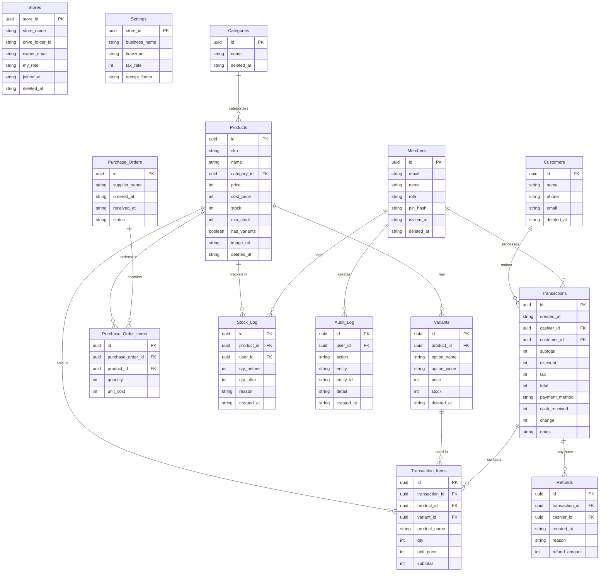

# Technical Requirements Document (TRD)
# POS UMKM — Point of Sale for Indonesian Small Businesses

| Field       | Detail                            |
|-------------|-----------------------------------|
| Version     | 2.17                              |
| Status      | Draft                             |
| Date        | May 2026                          |
| Related     | docs/PRD.md (Product Requirements)     |

---

## Table of Contents

1. [Platform & Architecture](#1-platform--architecture)
2. [Frontend](#2-frontend)
3. [Authentication — Google Login](#3-authentication--google-login)
4. [Data Layer — Google Sheets](#4-data-layer--google-sheets)
5. [Entity Relationship Diagram](#5-entity-relationship-diagram)
6. [Data Security](#6-data-security)
7. [Testing Strategy](#7-testing-strategy)
8. [Browser & Device Compatibility](#8-browser--device-compatibility)
9. [Peripheral Integration](#9-peripheral-integration)
10. [Hosting & Infrastructure](#10-hosting--infrastructure)
11. [Data Capacity & API Quotas](#11-data-capacity--api-quotas)
12. [Offline Mode](#12-offline-mode)
13. [Glossary](#13-glossary)

---

## 1. Platform & Architecture

### 1.1 Application Type

POS UMKM MVP is a **static Single-Page Application (SPA)** — a purely client-side web app with no custom backend server. All business logic runs in the browser. Data is stored in the owner's Google Drive via Google Sheets.

**Why this approach:**
- Zero server hosting costs — the app is 100% free to run
- Each business owner's data lives in their own Google account — no shared infrastructure
- Google handles data storage, replication, and availability

### 1.2 High-Level Architecture

```
┌──────────────────────────────────────────────────────┐
│                  User's Browser                       │
│                                                       │
│   ┌─────────────────────────────────────────────┐    │
│   │          React SPA (static files)            │    │
│   │  ┌─────────────┐   ┌─────────────────────┐  │    │
│   │  │  Google GIS  │   │  Sheets API v4      │  │    │
│   │  │  (Auth SDK)  │   │  + Drive API v3     │  │    │
│   │  └──────┬───────┘   └──────────┬──────────┘  │    │
│   └─────────┼──────────────────────┼─────────────┘    │
└─────────────┼──────────────────────┼──────────────────┘
              │ OAuth 2.0            │ HTTPS + OAuth token
 ┌────────────▼──────────────────────▼──────────────────┐
 │                   Google Cloud                        │
 │   ┌──────────────────┐   ┌──────────────────────┐    │
 │   │  Google Identity  │   │  Google Drive        │    │
 │   │  Services (auth)  │   │  (owner's account)   │    │
 │   └──────────────────┘   │  apps/pos_umkm/       │    │
 │                           │  ├── main [sheet]     │    │
 │                           │  └── stores/          │    │
 │                           │      └── <store_id>/  │    │
 │                           │          └── data     │    │
 │                           │    (preset-defined)   │    │
 │                           └──────────────────────┘    │
 └───────────────────────────────────────────────────────┘

Static files hosted on: GitHub Pages / Netlify / Vercel (free tier)
```

### 1.3 Data Ownership & Sharing

Each business owner's data lives in **their own Google Drive** organized under `apps/pos_umkm/` (see §4.2). The owner can own multiple stores (branches), each with its own store folder. The spreadsheet layout inside that folder is **preset-driven** — the default (`single`) puts all tabs in one `data` spreadsheet; the `multi` preset adds monthly transaction spreadsheets. Staff members are invited by the owner sharing the relevant spreadsheets via `StoreFolderService.shareSpreadsheet()`. The app never stores user data on its own servers.

### 1.4 MVP Constraints

| Constraint | Detail |
|---|---|
| Online required for first load | On the very first load (fresh browser, no IndexedDB data) the app must be online to hydrate from Google Sheets |
| Online required to sync writes | Writes queued in the outbox are replayed to Google Sheets as soon as connectivity is restored; data is not permanently lost but is not shared with other devices until then |
| Single cashier recommended | No atomic writes to Google Sheets; concurrent multi-device writes risk stock count discrepancies (acceptable for single-cashier UMKM — see §12.5) |
| Google account required | Every user (owner, family members, cashiers) must have a Google account |
| API rate limits | Throughput capped by Google Sheets API quotas (see §11); offline-first reduces read quota usage significantly |

---

## 2. Frontend

### 2.1 Tech Stack

| Component | Technology |
|---|---|
| Framework | React 18 (with TypeScript) |
| Build tool | Vite |
| Routing | React Router v6 |
| State management | Zustand (session state only: auth, activeStoreId, spreadsheet IDs) |
| Data fetching & caching | `@tanstack/react-query` — all server/Dexie data reads go through `useQuery` hooks in `src/hooks/`; mutations call service + `invalidateQueries` |
| UI components | Tailwind CSS + shadcn/ui (Button, Input, Label, Select, Dialog, Card, Badge, Table, Tabs, Alert, Separator, ScrollArea, Textarea, Checkbox) |
| Auth adapter (dev) | `MockAuthAdapter` — instant sign-in, no OAuth (dev only) |
| Auth adapter (prod) | `@react-oauth/google` (Google Identity Services) |
| Local data store | `DexieRepository` — IndexedDB-first reads, outbox-queued writes to Google Sheets |
| Offline storage | `dexie` (IndexedDB wrapper) — all entity tables + `_outbox` + `_syncMeta` |
| i18n | `react-i18next` |
| Unit testing | Vitest + `@testing-library/react` |
| E2E testing | Playwright |
| Linting & formatting | Biome |
| Hosting | GitHub Pages (via GitHub Actions) or Netlify/Vercel free tier |

### 2.2 Offline-First via Dexie.js (IndexedDB)

The production data layer uses **Dexie.js** as a local-first IndexedDB cache in front of Google Sheets. All reads are served instantly from IndexedDB. Writes go to IndexedDB first (immediately visible in the UI) then are queued in an `_outbox` table and replayed to Google Sheets in the background when online.

This means the app works fully offline after the initial data hydration. There are no service workers or PWA manifests — offline capability comes entirely from the data layer, not the network layer. The app shell (HTML/JS/CSS) itself still requires a network request to load on a fresh browser (unless cached by the browser's standard HTTP cache).

See §12 for the full offline-first architecture.

### 2.3 Responsive Breakpoints

| Breakpoint | Range | Primary Use |
|---|---|---|
| Mobile | 360px – 767px | Owner management, light cashiering |
| Tablet | 768px – 1023px | Primary cashiering terminal |
| Desktop | 1024px+ | Full management, reports |

### 2.4 Localization

- i18n: `react-i18next` with `id-ID` (Bahasa Indonesia) as default, `en-US` secondary
- Currency: `Rp` prefix, no decimals, `Intl.NumberFormat('id-ID')` (e.g., Rp 15.000)
- All monetary values stored in sheets as plain integers (IDR, no decimals) to avoid floating-point issues
- Date format: `dd/MM/yyyy HH:mm` (date-fns tokens) via `date-fns` + `date-fns-tz` with `id` locale; exposed as `formatDateTimeTZ(isoString)` in `src/utils/formatters.ts`
- Timestamps: ISO 8601 strings written to sheets; displayed in the user's browser-local timezone (`Intl.DateTimeFormat().resolvedOptions().timeZone`) by default — no manual timezone selection required

### 2.5 Module Structure

The codebase is organized into **feature modules**. Each module is self-contained: it owns its UI components, business logic, data access calls, and unit tests. Modules communicate only through well-defined interfaces (hooks or Zustand stores), not by importing each other's internals.

```
src/
├── api/
│   ├── adapters/        # Data access + auth layer
│   │   ├── index.ts             # Exports getRepos, makeRepo, syncManager, hydrationService
│   │   ├── LocalRepository.ts   # ILocalRepository + typed Repos map
│   │   ├── RemoteRepository.ts  # IRemoteRepository for raw Sheets access
│   │   ├── types.ts             # AuthAdapter, AdapterError, shared auth types
│   │   ├── zod-schemas.ts       # Typed row schemas + ALL_TAB_HEADERS
│   │   ├── dexie/
│   │   │   ├── db.ts            # Per-store Dexie DB factory + outbox schema
│   │   │   ├── DexieRepository.ts
│   │   │   ├── typed-repos.ts
│   │   │   └── DexieRepository.test.ts
│   │   └── google/
│   │       ├── GoogleAuthAdapter.ts
│   │       ├── SheetRepository.ts
│   │       ├── StoreFolderService.ts
│   │       ├── drive/
│   │       │   └── drive.client.ts
│   │       └── sheets/
│   │           ├── sheets.ops.ts
│   │           └── sheets.types.ts
│   └── services/        # Sync, hydration, migration, store activation/registry
│       ├── HydrationService.ts
│       ├── MigrationService.ts
│       ├── StoreActivationService.ts
│       ├── StoreRegistryService.ts
│       └── SyncManager.ts
├── modules/
│   ├── auth/            # Google login, token management, member invite
│   │   ├── AuthProvider.tsx
│   │   ├── LoginPage.tsx
│   │   ├── StorePickerPage.tsx
│   │   ├── auth.service.ts
│   │   ├── useAuth.ts
│   │   └── auth.test.tsx
│   ├── catalog/         # Products, variants, categories
│   │   ├── ProductList.tsx
│   │   ├── ProductForm.tsx
│   │   ├── CategoryList.tsx
│   │   ├── VariantManager.tsx
│   │   ├── catalog.service.ts
│   │   └── catalog.service.test.ts
│   ├── cashier/         # POS screen, cart, payment, receipt
│   │   ├── ProductSearch.tsx
│   │   ├── CartPanel.tsx
│   │   ├── PaymentModal.tsx
│   │   ├── useCart.ts
│   │   ├── cashier.service.ts
│   │   └── cashier.service.test.ts
│   ├── inventory/       # Stock opname, stock adjustments, purchase orders
│   │   ├── StockOpname.tsx
│   │   ├── PurchaseOrders.tsx
│   │   ├── inventory.service.ts
│   │   └── inventory.service.test.ts
│   ├── customers/       # Customer management
│   │   ├── CustomersListPage.tsx
│   │   ├── CustomerSearch.tsx
│   │   ├── RefundFlow.tsx
│   │   ├── customers.service.ts
│   │   └── refund.service.ts
│   ├── reports/         # Sales reports, reconciliation
│   │   ├── DailySummary.tsx
│   │   ├── SalesReport.tsx
│   │   ├── GrossProfitReport.tsx
│   │   ├── CashReconciliation.tsx
│   │   ├── reports.service.ts
│   │   └── reports.service.test.ts
│   └── settings/        # Business config, member management, store management
│       ├── BusinessProfile.tsx
│       ├── MemberManagement.tsx
│       ├── QRISConfig.tsx
│       ├── settings.service.ts
│       └── store-management.service.ts
├── components/          # Shared, reusable UI components
│   ├── NavBar.tsx
│   ├── BottomNav.tsx
│   ├── AppShell.tsx
│   ├── SyncStatus.tsx
│   └── ui/
├── config/              # Preset and schema configuration for sheets/tabs
├── hooks/
│   └── queryClient.ts   # Shared TanStack Query client
├── i18n/
│   └── i18n.ts          # i18next initialization
├── pages/               # Cross-module orchestrators and non-module pages only
│   ├── CashierPage.tsx
│   ├── LandingPage.tsx
│   ├── NotFoundPage.tsx
│   ├── OutboxPage.tsx
│   └── StoreManagementPage.tsx
├── store/
│   ├── authStore.ts
│   ├── storeMapStore.ts
│   └── syncStore.ts
├── tests/
│   └── e2e/
└── utils/
    ├── formatters.ts
    ├── logger.ts
    ├── uuid.ts
    └── validators.ts
```

**Key rules:**
- `src/api/adapters/` is the only data and auth abstraction layer. Module service files call `getRepos()` for IndexedDB-first access and never talk to Google APIs directly.
- `src/api/adapters/google/sheets/` contains the low-level Sheets operations used by `SheetRepository`; `SheetRepository`, `SyncManager`, and `HydrationService` are the only layers that talk to Google Sheets directly.
- No module imports from another module's internals. Shared session state goes through **Zustand** (`src/store/`), while shared TanStack Query cache primitives live in `src/hooks/queryClient.ts`.
- `HydrationService.hydrateAll()` runs only after the store map is ready, reads spreadsheet IDs from that map, and updates `syncStore.lastHydratedAt` so page-level queries can react to refreshed Dexie data.
- Pure functions (formatters, validators, calculations) live in `src/utils/` and are unit-testable without DOM or API.
- **Route import rule:** `src/router.tsx` imports route components directly from `src/modules/` for single-module routes. `src/pages/` is reserved for multi-module orchestrators (`CashierPage`) and pages with no owning module (`LandingPage`, `NotFoundPage`, `OutboxPage`, `StoreManagementPage`). There are no empty page-shell files — if a route needs only one module's component, the module component is used directly.

### 2.6 Application Layout — AppShell, NavBar & BottomNav

Authenticated pages share a common layout provided by `AppShell`, which is mounted as a **React Router v6 layout route** in `src/router.tsx`. This avoids repeating nav markup in every page component.

```
router.tsx
└── <ProtectedRoute>
    └── <AppShell>               ← layout route at path "/:storeId"
        ├── <NavBar />           ← top bar; rendered on all screen sizes
        ├── <main pb-16 md:pb-0> ← page-specific content via <Outlet />
        └── <BottomNav />        ← fixed bottom; only visible below md (md:hidden)
```

**AppShell (`src/components/AppShell.tsx`):** Renders `<NavBar />` at the top, `<Outlet />` in a `flex-1 flex-col` main area (with `pb-16 md:pb-0` to clear the BottomNav on mobile), and `<BottomNav />` fixed at the bottom.

**NavBar (`src/components/NavBar.tsx`):** A `h-14 md:h-16` top navigation bar.

| Area | Content |
|---|---|
| Left | Logo / app name ("POS UMKM") |
| Centre | Role-filtered nav links — **hidden on mobile** (`hidden md:flex`), shown on md+ |
| Right | Sign-out button (always visible); username shown on lg+ |

**BottomNav (`src/components/BottomNav.tsx`):** A fixed `h-16` bottom bar, `md:hidden`. Renders the same role-filtered nav items as NavBar (icon + label), with active-route highlight. Uses `data-testid="bottom-nav-{route}"` (distinct from NavBar's `nav-{route}`) to avoid duplicate testids in the DOM at desktop viewport where both exist but BottomNav is `display:none`.

Navigation links are filtered at render time using the same `ROLE_RANK` hierarchy as `RoleRoute`.

All routes are nested under the `/:storeId` path segment (e.g. `/pos-umkm/<storeId>/cashier`). The Vite `base` is `/pos-umkm/` and the React Router `basename` is also `/pos-umkm`, so the browser URL for a route like `cashier` in store `abc` is `/pos-umkm/abc/cashier`.

| Route | Full URL example | Label | Min role | Icon |
|---|---|---|---|---|
| `cashier` | `/pos-umkm/:storeId/cashier` | Kasir | cashier | ShoppingCart |
| `catalog` | `/pos-umkm/:storeId/catalog` → redirects to `catalog/products` | Katalog | manager | Package |
| `catalog/products` | `/pos-umkm/:storeId/catalog/products` | Katalog (Produk tab) | manager | Package |
| `catalog/categories` | `/pos-umkm/:storeId/catalog/categories` | Katalog (Kategori tab) | manager | Package |
| `inventory` | `/pos-umkm/:storeId/inventory` | Inventori | manager | Archive |
| `customers` | `/pos-umkm/:storeId/customers` | Pelanggan | manager | Users |
| `reports` | `/pos-umkm/:storeId/reports` | Laporan | manager | BarChart2 |
| `settings` | `/pos-umkm/:storeId/settings` | Pengaturan | owner | Settings |

`NavBar` and `BottomNav` both use **relative `to`** values (no leading `/`) so links resolve within the current `/:storeId` parent. The active-route highlight for `catalog` uses React Router's default prefix matching — it remains highlighted on `catalog/products` and `catalog/categories`.

`AppShell` reads `useParams<{ storeId: string }>()` and calls `setActiveStoreId` whenever the URL `:storeId` differs from the Zustand store — the URL is the **authoritative source** for the active store.

Public routes (`/`, `/login`, `/join`) and the onboarding routes (`/setup`, `/stores`) are **outside** the `/:storeId` layout route and do not show any navigation.

**Mobile-first CashierPage layout:**

On mobile (< md) the cashier screen is a single full-height column. Two toggle tabs at the top switch between the **Produk** view (ProductSearch grid) and the **Keranjang** view (cart, totals, pay button). A live item count badge on the Keranjang tab shows how many items are in the cart.

On md+ the two panels are shown side-by-side: product search on the left (flex-1) and the cart panel fixed at `w-80` on the right.

The `CashierPage` outer container uses `flex flex-1 overflow-hidden flex-col md:flex-row` so it fills the remaining viewport height without a hard-coded `h-[calc(100vh-4rem)]`. `ProductSearch` uses `flex-1 min-h-0 overflow-y-auto` on the product grid to enable proper scrolling in a flex column — without `min-h-0` the flex child defaults to `min-height: auto` which prevents overflow.

**`data-testid` attributes** (E2E locators):

| Element | `data-testid` |
|---|---|
| `<header>` wrapper | `navbar` |
| App logo span | `navbar-logo` |
| `<nav>` element | `navbar-nav` |
| Each NavBar link | `nav-{route}` e.g. `nav-cashier` |
| Username display | `navbar-username` |
| Sign-out button | `btn-logout` |
| `<AppShell>` root | `app-shell` |
| `<main>` content area | `main-content` |
| BottomNav container | `bottom-nav` |
| Each BottomNav link | `bottom-nav-{route}` e.g. `bottom-nav-cashier` |
| Mobile Produk tab | `btn-tab-products` |
| Mobile Keranjang tab | `btn-tab-cart` |

### 2.7 Data Layer Architecture

The production data path has three distinct subsystems — each with a clear, single responsibility:

```
GDrive (StoreFolderService)
  └─ Provisions store folders + spreadsheets via Drive API (MigrationService, setup only; always-online)
  └─ Traverses the store folder tree on activation to build the store map (SheetMeta per tab)

IndexedDB / Dexie (DexieRepository)
  └─ Browser-local read/write; source of truth for all feature module reads
  └─ Every write also enqueues an OutboxEntry for background sync

Google Sheets API (SheetRepository + SyncManager + HydrationService)
  └─ Remote persistence; written to only by SyncManager (drains outbox)
  └─ Read by HydrationService on login to populate IndexedDB
```

**Two separate repository interfaces keep these concerns explicit:**

```
ILocalRepository<T>          — used by feature modules via getRepos()
  getAll()                   — read from IndexedDB
  batchInsert(rows)          — write to IndexedDB + enqueue outbox
  batchUpdate(updates)       — patch records by id + enqueue outbox
  batchUpsert(rows)          — insert-or-update by id + enqueue outbox
  softDelete(id)             — stamp deleted_at + enqueue outbox

IRemoteRepository<T>         — used by sync/setup layer only
  getAll()                   — read from Google Sheets API
  batchInsert(rows)          — append rows to Sheets
  batchUpdate(updates)       — update cells in Sheets
  softDelete(id)             — stamp deleted_at in Sheets
  createTable(headers)       — write column header row (setup only)
```

**`DexieRepository<T>`** implements `ILocalRepository<T>`. It writes to a store-scoped Dexie database and appends structured `OutboxEntry.operation` payloads. Spreadsheet routing is resolved later by `SyncManager` from the active store map, not stored in the repository instance.

**`SheetRepository<T>`** implements `IRemoteRepository<T>`. It is used by `SyncManager` (to drain the outbox) and by `makeRepo()` in setup code (where the device is guaranteed online). Feature module service files never call it directly.

**`GoogleAuthAdapter`** — wraps `@react-oauth/google`. Stores access token in memory. Implements `AuthAdapter`.

**Key rule:** `getRepos()` returns `Repos`. `makeRepo()` returns `IRemoteRepository<T>`. Feature modules only ever call `getRepos()`.

**Per-model sub-interfaces:** Five entries in `Repos` use narrower sub-interfaces instead of bare `ILocalRepository<T>`:

| Field | Interface | Extra methods |
|---|---|---|
| `products` | `IProductRepository` | `findById(id)`, `findByCategoryId(categoryId)` |
| `variants` | `IVariantRepository` | `findById(id)`, `findByProductId(productId)` |
| `transactions` | `ITransactionRepository` | `findById(id)`, `findByDateRange(start, end)` |
| `transactionItems` | `ITransactionItemRepository` | `findByTransactionId(transactionId)` |
| `purchaseOrderItems` | `IPurchaseOrderItemRepository` | `findByOrderId(orderId)` |

Each sub-interface extends `ILocalRepository<T>` — the five base methods are always available. The additional methods use Dexie's indexed columns (e.g. `category_id`, `product_id`, `created_at`) for O(log n) lookups instead of full-table scans. The concrete implementations are `DexieProductRepository`, `DexieVariantRepository`, `DexieTransactionRepository`, `DexieTransactionItemRepository`, and `DexiePurchaseOrderItemRepository` (all in `dexie/typed-repos.ts`), each extending the base `DexieRepository<T>`. `DexieRepository.db` is `protected` (not `private`) to allow subclass access.

---

## 3. Authentication — Google Login

> **Note on auth:** The production implementation uses `GoogleAuthAdapter` (GIS). Tests mock the adapter layer directly rather than routing through a separate development auth adapter.

### 3.1 Production Auth Flow (GoogleAuthAdapter)

1. User clicks "Sign in with Google" on the landing page
2. Google Identity Services (GIS) opens a Google OAuth consent popup
3. User grants scopes (see §3.2)
4. GIS returns an **access token** (valid for 1 hour)
5. The app stores the access token **in memory only** (never localStorage, never a cookie)
6. All `SheetRepository` calls include `Authorization: Bearer <token>` header
7. When the token expires, GIS silently refreshes it (`prompt: 'none'`) as long as the browser session is active
8. After successful auth, `LoginPage` checks for a cached `activeStoreId` in `localStorage`:
   - **Fast path (returning user):** `activeStoreId` found → navigates to `/<storeId>/cashier` (AppShell loads store map)
   - **Slow path (new session):** no cached ID → navigates to `/stores` (StorePickerPage)

### 3.2 Google OAuth Scopes

| Scope | Who needs it | Purpose |
|---|---|---|
| `openid` | All users | Identify the user |
| `profile` | All users | Display name and photo in the UI |
| `email` | All users | Identify the account |
| `https://www.googleapis.com/auth/spreadsheets` | All users | Read and write spreadsheet data |
| `https://www.googleapis.com/auth/drive` | Owner only | Create folder structure, share folders with members, create spreadsheets |

> **Members** only need the `spreadsheets` scope — they access the `data` spreadsheet shared directly with their account. The `drive` scope is requested only for the owner at first-time setup (and when inviting members or creating new branches). The app detects whether the user is an owner or member based on the `Members` record in the data spreadsheet.

### 3.3 First-Time Setup (Owner) and Post-Login Store Resolution

Every login (first-time and returning) goes through `/stores` (StorePickerPage) unless `activeStoreId` is already in `localStorage`. StorePickerPage calls `findOrCreateMain()` which:

1. Checks `localStorage` for a cached `mainSpreadsheetId`
2. If not found: calls Drive API to create `apps/pos_umkm/main` spreadsheet with a `Stores` tab, saves ID to `localStorage`
3. Returns the list of stores from `main.Stores`

**Based on store count:**
- **0 stores (first-time owner):** navigates to `/setup` (SetupWizard)
- **1 store:** auto-activates the store and navigates to `/<storeId>/cashier`
- **2+ stores:** shows a store picker UI; user selects a branch or adds a new one

**When navigating to /setup (SetupWizard):**

1. Collects business name from the owner
2. Calls `MigrationService.runStoreSetup(businessName)` which:
   a. Generates a UUID as the store's permanent `store_id`
   b. Creates `apps/pos_umkm/stores/<store_id>/` folder (Drive scope required)
   c. Runs `MigrationService.migrate(storeId, date, ACTIVE_PRESET)` — creates all spreadsheets and tab headers defined by the active preset (see §4.1)
   d. Registers the store in `main.Stores` (store_id, store_name, drive_folder_id, owner_email)
   e. Calls `StoreActivationService.activateStore()` — traverses the store folder, populates the store map
3. Saves `activeStoreId` and `mainSpreadsheetId` to `localStorage`
4. Saves the owner's profile in the `Members` sheet with role `owner`

> **Preset selection:** The spreadsheet layout (how many spreadsheets, which tabs go where) is controlled by `VITE_STORE_PRESET` environment variable: `single` (all in one `data` spreadsheet), `multi` (permanent data + monthly transaction spreadsheets), `split` (each domain in its own spreadsheet). Defaults to `multi`. See §4.1.

**Multiple branches:** From the Settings screen, the owner can add branches. Each branch goes through steps 2–9 above. The owner's `main.Stores` tab accumulates one row per branch.

**Store deletion constraint:** The currently active store (matching `activeStoreId` in Zustand) cannot be deleted. The delete button in `StoreManagementPage` is disabled for the active store. The owner must switch to a different store first before deleting the current one.

### 3.4 Family & Member Access

**Use case:** A family-owned warung where the father (Pak Santoso) is the owner. His wife and children help manage the store and need access to the same data.

**Flow:**
1. **Owner invites a member:**
   - Owner opens Settings → Manage Members → enters member's email and role
   - App calls `StoreFolderService.shareSpreadsheet(dataSpreadsheetId, email, "editor")` for each spreadsheet the member needs access to
   - For the `single` preset: shares one `data` spreadsheet; for `multi`/`split`: shares multiple spreadsheets
   - App appends a row to the `Members` sheet: `{id, email, name, role: "cashier", invited_at}`
   - App displays a **Store Link** — a URL containing the `dataSpreadsheetId` (the primary store spreadsheet) encoded as `?sid=<id>`

2. **Member joins:**
   - Member opens the Store Link in their browser
   - App stores the `dataSpreadsheetId` from the `?sid` param in `localStorage`
   - Member clicks "Sign in with Google" — only requests the `spreadsheets` scope (no `drive` needed)
   - App reads `Members` tab to find their email, loads role and permissions
   - App reads `Settings` tab to get `store_id` and `store_name`
   - App creates (or reads) the member's own `main` spreadsheet in their Drive and adds a `Stores` row for this store (including `drive_folder_id`)
   - Member can now read/write the shared spreadsheets with their assigned role

3. **Store switching (multi-branch owner):**
   - The owner's `main.Stores` tab lists all branches they own or manage
   - Active store is tracked in `localStorage` (`activeStoreId`)
   - Switching branches updates `localStorage` and reloads data from the selected branch's data spreadsheet
   - A member who works at multiple stores has multiple rows in their own `main.Stores` tab, one per store

5. **Role enforcement:**
   - Role is read from the `Members` sheet on login and stored in React state
   - UI hides or disables features based on role (e.g., cashier cannot view reports or change prices)
   - This is UI-level enforcement only (no server-side enforcement, as there is no backend); this is acceptable for a family trust model

| Role | Permissions |
|---|---|
| `owner` | Full access: all features, member management, settings, branch creation |
| `manager` | Reports, inventory, cashier — no member management, no branch creation |
| `cashier` | Cashier screen only — no reports, no settings |

### 3.5 POS Terminal Lock

- After configurable idle period (default 5 minutes), the app displays a lock screen requiring a PIN
- The PIN is a 4–6 digit code set per user, stored as a bcrypt hash in the `Members` sheet
- PIN validation runs entirely in the browser — no network call required

---

## 4. Data Layer — Google Sheets

> **Data schema note:** The column names, data types, and conventions in this section define the Google Sheets schema that `HydrationService` reads from and `SyncManager` writes to. `DexieRepository` stores objects with identical field names in IndexedDB.

### 4.1 Preset-Driven Spreadsheet Model

The spreadsheet layout is **config-driven** via `src/config/presets/` and selected at build time by the `VITE_STORE_PRESET` environment variable (default: `multi`). The `MigrationPayload` config groups tabs by `path` — tabs sharing the same path end up in the same spreadsheet.

There are always two fixed spreadsheet types regardless of preset:

| Spreadsheet | Location in Drive | Contents |
|---|---|---|
| **Main** | `apps/pos_umkm/main` | Owner's personal store registry (`Stores` tab); never shared with members |
| **Store spreadsheet(s)** | `apps/pos_umkm/stores/<store_id>/...` | All store data; layout defined by the active preset |

**Available presets:**

| Preset | `VITE_STORE_PRESET` | Spreadsheet layout |
|---|---|---|
| **Single** | `single` | All tabs (reference + transactions) in one `data` spreadsheet |
| **Multi** | `multi` (default) | Reference data in `data`; transactions in monthly `transaction_<year>-<month>` spreadsheets |
| **Split** | `split` | Each domain (settings, members, master_data, customers, transactions) in its own spreadsheet |

Monthly spreadsheets (only in `multi` and `split`) are auto-created by `StoreActivationService.ensureMonthlySheets()` on activation. The `Main` spreadsheet is private to each user's Google account.

### 4.2 Drive Folder Structure

```
My Drive (owner's Google account)
└── apps/
    └── pos_umkm/
        ├── main  [spreadsheet — private, never shared]
        │   └── Stores tab
        │       columns: store_id, store_name, drive_folder_id,
        │                owner_email, my_role, joined_at, deleted_at
        │
        └── stores/
            └── <store_id>/              ← store folder (drive_folder_id)
                │                          traversed by StoreFolderService.traverse()
                │
                │  ← SINGLE preset (VITE_STORE_PRESET=single):
                └── data  [spreadsheet]
                    └── (all tabs — see §4.3)

                   ← MULTI preset (VITE_STORE_PRESET=multi, default):
                ├── data  [spreadsheet — reference data]
                └── transactions/
                    └── <year>/
                        └── transaction_<year>-<month>  [spreadsheet]
```

**Active store context** is stored in the Zustand store map (`pos_umkm_storemap_<storeId>`, persisted to localStorage) and `localStorage` (`activeStoreId`). On login, `StoreActivationService.activateStore(store)` calls `storeFolderService.traverse(drive_folder_id, config)` to populate the store map. The `main.Stores` tab is the source of truth for the store list and `drive_folder_id`.

| localStorage key | Value | Set by |
|---|---|---|
| `mainSpreadsheetId` | ID of the owner's `main` spreadsheet | `StoreRegistryService.findOrCreateMain()` |
| `activeStoreId` | UUID of the active store | `MigrationService.runStoreSetup()` / `activateStore()` |
| `pos_umkm_storemap_<storeId>` | Zustand store map — `sheets` (tab → SheetMeta) + `monthlySheets` (year → month → MonthlySheetMeta) | `StoreActivationService.activateStore()` |

**Store map** (`TraverseResult`) — built by `StoreFolderService.traverse(storeFolderId, config)`. Contains:
- `sheets`: `Record<tabName, SheetMeta>` — each tab's spreadsheet ID, sheet ID, and headers
- `monthlySheets`: `Record<year, Record<month, MonthlySheetMeta>>` — only populated in `multi`/`split` presets

The store map is rebuilt on every `activateStore()` call (TTL-guarded); it is also directly patched when `ensureMonthlySheets()` creates a new sheet that Drive's folder listing hasn't yet indexed.

### 4.3 Data Spreadsheet — Sheet Tabs

The tab layout is defined by the active preset in `src/config/presets/`. All column definitions live in the preset JSON files (`store-single.json`, `store-multi.json`, `store-split.json`). The table below shows the tabs present in the **single** preset (all in one `data` spreadsheet).

| Tab Name | Purpose |
|---|---|
| `Settings` | Business profile, tax rate, receipt footer, timezone, PIN salt, `store_id` (UUID) |
| `Members` | All staff (owner, managers, cashiers) with roles and bcrypt-hashed PINs |
| `Categories` | Product category list |
| `Products` | Product catalog — name, SKU, price, stock, category |
| `Variants` | Product variants (size, color) linked to Products |
| `Customers` | Customer name and phone number |
| `Transactions` | One row per completed transaction |
| `Transaction_Items` | One row per line item, linked to a transaction by `transaction_id` |
| `Refunds` | Refund records linked to original transactions |
| `Purchase_Orders` | Incoming stock records (linked to Products) |
| `Purchase_Order_Items` | Line items for each purchase order |
| `Stock_Log` | Append-only stock adjustment history |
| `Audit_Log` | Append-only log of sensitive actions (price changes, refunds, member changes) |

### 4.5 Row Format Conventions

- **Row 1:** Frozen header row. Never modified after initialization.
- **Row 2+:** Data rows, appended only. No sorting or reordering.
- **Primary keys:** Client-generated UUID v4 in column A.
- **Timestamps:** ISO 8601 UTC strings (e.g., `2026-04-18T05:30:00Z`).
- **Soft deletes:** A `deleted_at` column; the app filters rows where this is non-empty.
- **Monetary values:** Plain integers in IDR (no decimals). `Rp 15.000` → stored as `15000`.
- **References:** Foreign keys are stored as UUID strings (not sheet row numbers, which can shift).

### 4.6 Example: Products Tab

| A: id | B: category_id | C: name | D: sku | E: price | F: stock | G: has_variants | H: created_at | I: deleted_at |
|---|---|---|---|---|---|---|---|---|
| uuid | uuid-cat | Indomie Goreng | SKU001 | 3500 | 48 | FALSE | 2026-04-01T00:00:00Z | |

### 4.7 Example: Transactions Tab

| A: id | B: created_at | C: cashier_id | D: customer_id | E: subtotal | F: discount_type | G: discount_value | H: discount_amount | I: tax | J: total | K: payment_method | L: cash_received | M: change | N: receipt_number | O: notes |
|---|---|---|---|---|---|---|---|---|---|---|---|---|---|---|
| uuid | 2026-04-18T… | user-uuid | uuid or empty | 15000 | PERCENT | 0 | 0 | 1650 | 16650 | CASH | 20000 | 3350 | RCP-001 | |

### 4.8 Reading Data

- **Master data (products, categories, customers):** Hydrated into IndexedDB on login and then read through `getRepos()`; UI reads are local-first.
- **Product search:** Performed client-side against the hydrated local product list (no API call per keystroke).
- **Active store context:** Read from the store map (Zustand, persisted to `pos_umkm_storemap_<storeId>` in localStorage). The map is built by `StoreFolderService.traverse(drive_folder_id, config)` on `activateStore()`. The `main.Stores` tab is the source of truth for the store list and `drive_folder_id`.
- **Reports:** Reads from Dexie's indexed `Transactions` and `Transaction_Items` tables. Date-range queries use `transactions.findByDateRange(start, end)` — all transaction data is in the single `data` spreadsheet, no per-month spreadsheet lookup needed.

### 4.9 Writing Data

- New records: `values.append` to add a row to the appropriate tab.
- Stock updates: `values.get` to read the current stock row, compute new value, then `values.update` on that specific cell.
- Settings: `values.update` on specific named cells in the `Settings` tab.

> **Stock update race condition:** Read → compute → write is not atomic. For single-cashier (or family-trust) use this is acceptable. Owners should run periodic stock opname to reconcile discrepancies.

### 4.10 API Calls Per Transaction

A typical transaction (3 distinct products):
1. `values.append` → `Transactions` tab (1 call)
2. `values.append` → `Transaction_Items` tab, all items batched (1 call)
3. `values.get` + `values.update` per product stock cell (2 calls × 3 products = 6 calls)

Total: **~8 API calls per transaction** in the worst case.

---

## 5. Entity Relationship Diagram

The following diagram shows the logical relationships between data entities. Each entity maps to a tab in the `data` spreadsheet (or to the `Stores` tab in the `main` spreadsheet).



**Spreadsheet mapping (single preset):**
- **Main sheet** (`apps/pos_umkm/main`): Stores
- **Data sheet** (`apps/pos_umkm/stores/<store_id>/data`): Settings, Members, Categories, Products, Variants, Customers, Transactions, Transaction_Items, Refunds, Purchase_Orders, Purchase_Order_Items, Stock_Log, Audit_Log

In the `multi` preset, Transactions/Transaction_Items/Refunds live in monthly `transaction_<year>-<month>` spreadsheets instead of the `data` spreadsheet.

---

## 6. Data Security

| Layer | Detail |
|---|---|
| Transport | HTTPS enforced by static host (Netlify/GitHub Pages) and Google APIs |
| Auth token | OAuth access token in memory only; never written to localStorage or cookies |
| Data storage | User data in owner's Google Drive; Google handles encryption at rest |
| App secrets | No server-side secrets; Google OAuth client ID is public (registered to the app domain) |
| OAuth scope | `drive` (owner — folder creation and sharing) + `spreadsheets` (all users); members need `spreadsheets` only |
| PIN storage | PIN stored as bcrypt hash in `Members` sheet; raw PIN never stored or transmitted |
| Audit log | Sensitive actions (price edits, stock adjustments, refunds, member changes) appended to `Audit_Log` tab |
| Member access | Data sharing via Google Sheets spreadsheet sharing (`stores/<store_id>/data`); each member authenticates with their own Google account |
| Data residency | Data stored on Google's globally distributed servers. Known MVP trade-off vs. UU No. 27/2022; revisit for production |

---

## 7. Testing Strategy

### 7.1 Approach: Test-Driven Development (TDD)

All feature development follows the TDD cycle:

1. **Red** — write a failing test that describes the desired behavior
2. **Green** — write the minimal code to make the test pass
3. **Refactor** — clean up without breaking the test

Tests are written before or alongside production code. PRs without tests for new behavior are not merged.

### 7.2 Test Layers

| Layer | Tool | Scope |
|---|---|---|
| Unit | Vitest + `@testing-library/react` | Pure functions, service functions, React hooks, individual components |
| Integration | Vitest + MSW (Mock Service Worker) | Module-level flows with mocked Sheets API responses |
| End-to-End (E2E) | Playwright | Full business flows in a real browser against a test Google account |

### 7.3 Unit & Integration Tests

**Location:** Co-located with source files (e.g., `catalog.service.test.ts` next to `catalog.service.ts`)

**Coverage targets:**
- All pure functions in `lib/` must have 100% branch coverage
- All `.service.ts` files (Sheets API interactions) must be tested with mocked HTTP responses
- All React hooks must be tested with `renderHook`

**Test naming convention:**
```
describe('calculateTotal', () => {
  it('applies percentage discount before tax', () => { ... })
  it('rounds to nearest 100 IDR', () => { ... })
  it('returns 0 tax when PPN is disabled', () => { ... })
})
```

**Mocking Sheets API:** Use `msw` to intercept `fetch` calls to `sheets.googleapis.com`. Each service test provides a fixture of sheet rows as the mock response. No real Google account needed for unit/integration tests.

### 7.4 End-to-End Tests (Playwright)

**Location:** `src/tests/e2e/`

**Test account:** A dedicated Google test account with a pre-seeded test spreadsheet. Credentials stored in environment variables, never committed to the repository.

**Playwright configuration:**
- Browsers: Chromium (primary), Firefox, WebKit
- Viewport: Tablet (768×1024) as primary (matches cashier terminal use case)
- Base URL: `http://localhost:5173` for local; deployed URL for CI

**Locator rule — `data-testid` required:**
All interactive elements and key output elements in production components **must** carry a `data-testid` attribute. E2E tests **must** locate elements using `page.getByTestId()` as the primary selector. Text-based locators (`getByText`, `getByRole` with name, `getByPlaceholder`) are only permitted for:
- Page-level URL assertions (`expect(page).toHaveURL(...)`)
- Waiting for page transitions (`page.waitForURL(...)`)
- Elements that have no production component (e.g., the `<body>` element)

`getByRole`, `getByPlaceholder`, `.filter({ hasText })`, and `.first()` / `.last()` are **not allowed** as the primary locator in assertions or interactions. Every element that an E2E test interacts with or asserts on must be identified by its `data-testid`.

**`data-testid` naming convention:**
- Buttons: `btn-<action>` (e.g., `btn-pay`, `btn-invite-member`, `btn-method-cash`)
- Inputs: `input-<field>` (e.g., `input-cash`, `input-discount-value`)
- Output/display elements: `<semantic-name>` (e.g., `change-amount`, `receipt-preview`)
- Per-item elements in lists: `<element>-<id>` (e.g., `product-card-e2e-prod-1`, `btn-retrieve-cart-0`)

**Business flows covered:**

| Spec file | Flow |
|---|---|
| `setup.flow.spec.ts` | First-time login, business profile setup, initial product creation |
| `cashier.flow.spec.ts` | Add items to cart → apply discount → cash payment → print receipt |
| `cashier.flow.spec.ts` | Add items → QRIS payment (manual confirm) → WhatsApp receipt share |
| `cashier.flow.spec.ts` | Multi-item cart → split payment (part cash, part QRIS) |
| `cashier.flow.spec.ts` | Hold transaction → start new → retrieve held transaction |
| `inventory.flow.spec.ts` | Add product → complete sale → verify stock decremented |
| `inventory.flow.spec.ts` | Stock opname — enter physical count, verify discrepancy logged |
| `inventory.flow.spec.ts` | Create purchase order → receive stock → verify stock incremented |
| `reports.flow.spec.ts` | View daily sales summary → verify transaction appears |
| `reports.flow.spec.ts` | Filter report by date range → export to PDF |
| `reports.flow.spec.ts` | End-of-day cash reconciliation — enter closing balance |
| `members.flow.spec.ts` | Owner invites member via email → member joins via Store Link |
| `members.flow.spec.ts` | Cashier role cannot access reports page (redirected) |
| `members.flow.spec.ts` | POS terminal auto-locks after idle → cashier unlocks with PIN |

**Example test structure:**
```typescript
// cashier.flow.spec.ts
test('complete a cash transaction', async ({ page }) => {
  await page.goto('/')
  await signInAsTestCashier(page)

  await page.getByTestId('product-search-input').fill('Indomie')
  await page.getByTestId('product-card-prod-indomie').click()
  await expect(page.getByTestId('btn-pay')).toContainText('3.500')

  await page.getByTestId('btn-pay').click()
  await page.getByTestId('btn-method-cash').click()
  await page.getByTestId('input-cash').fill('5000')
  await expect(page.getByTestId('change-amount')).toHaveText('Rp 1.500')

  await page.getByTestId('btn-cash-confirm').click()
  await expect(page.getByTestId('receipt-success')).toBeVisible()
})
```

### 7.5 CI Integration

Tests run automatically on every pull request via GitHub Actions:

```yaml
# .github/workflows/test.yml
jobs:
  unit:
    runs-on: ubuntu-latest
    steps:
      - run: npm ci
      - run: npm run test        # Vitest

  e2e:
    runs-on: ubuntu-latest
    steps:
      - run: npm ci
      - run: npx playwright install --with-deps
      - run: npm run build && npx serve dist &
      - run: npx playwright test
```

---

## 8. Browser & Device Compatibility

### 8.1 Supported Browsers

| Browser | Minimum Version | Notes |
|---|---|---|
| Chrome (Android/Desktop) | 90+ | Primary target |
| Samsung Internet | 14+ | Common on low-cost Android |
| Safari (iOS/macOS) | 14+ | Google Sign-In popup may require user gesture |
| Firefox (Desktop) | 90+ | Secondary desktop support |
| Edge (Desktop) | 90+ | Chromium-based |

> **Not supported:** Internet Explorer; browsers without ES2020 support.

### 8.2 Required Browser APIs

| API | Usage |
|---|---|
| Fetch API | Google Sheets / Drive API calls |
| Web Crypto | Client-side bcrypt for PIN hashing |
| localStorage | Store `spreadsheetId` (non-sensitive) |
| Popup windows | Google OAuth consent (must not be blocked) |
| `window.print()` | Receipt printing (post-MVP priority; basic support in MVP) |
| MediaDevices (camera) | Barcode scanning (post-MVP) |

---

## 9. Peripheral Integration

> **Not a priority for MVP.** Peripheral integration (thermal printer, barcode scanner) is deferred to post-MVP. The cashier screen in MVP uses manual product search only.

**Post-MVP plan:**

| Peripheral | Post-MVP Approach |
|---|---|
| Thermal printer (58mm / 80mm) | `window.print()` with CSS `@media print` + `@page` size rules |
| Thermal printer (advanced) | Web Bluetooth API with ESC/POS commands |
| Barcode scanner (USB) | USB HID — no driver needed; detected via rapid keypress pattern in search input |
| Barcode scanner (camera) | `@zxing/browser` library via `MediaDevices` API |

---

## 10. Hosting & Infrastructure

### 10.1 Static Hosting Options (All Free)

| Provider | Free Tier | Notes |
|---|---|---|
| **GitHub Pages** | Unlimited for public repos | Deploy via GitHub Actions; custom domain supported |
| **Netlify** | 100GB bandwidth/month | Drag-and-drop or CI/CD; automatic HTTPS |
| **Vercel** | 100GB bandwidth/month | Git-connected deploy; excellent for React/Vite |

Recommended: **GitHub Pages** for maximum transparency and zero vendor lock-in.

### 10.2 Google Cloud Console Setup (One-Time)

The app requires a Google Cloud project with:
- **OAuth 2.0 Client ID** (Web application type) — client ID is public, registered to the app domain
- **Google Sheets API** enabled
- **Google Drive API** enabled
- Authorized JavaScript origins and redirect URIs set to the hosting domain

No ongoing Google Cloud cost at expected API usage levels.

### 10.3 Deployment Pipeline

```
GitHub repo
  └── Pull Request → GitHub Actions: unit tests + Playwright E2E
  └── Merge to main → GitHub Actions: vite build → deploy to GitHub Pages
```

---

## 11. Data Capacity & API Quotas

### 11.1 Google Sheets Limits

| Limit | Value |
|---|---|
| Cells per spreadsheet | 10,000,000 |
| Sheets (tabs) per spreadsheet | 200 |
| Max single API response | 10MB |

Monthly transaction sheets stay small by design. A shop doing 100 transactions/day × 5 items = ~500 rows in `Transaction_Items` per day = ~15,000 rows per month — well within limits.

### 11.2 Google Sheets API Quotas (Free Tier)

| Quota | Limit | Impact |
|---|---|---|
| Read requests / minute / project | 300 | Shared across all users of the app |
| Write requests / minute / project | 300 | ~5 concurrent cashiers safely across all users |
| Read requests / minute / user | 60 | Per Google account |
| Write requests / minute / user | 60 | ~7–10 transactions/minute per cashier |

**Practical throughput:** ~8 API calls per transaction → max ~7 transactions/minute per cashier. A typical UMKM cashier handles 1 transaction every 2–5 minutes, well within limits.

### 11.3 Free Tier Limits (App-Enforced)

No backend to enforce hard limits. The app displays a warning banner when the thresholds from PRD (100 products, 500 transactions/month) are reached but does not block usage.

---

## 12. Offline Mode

The production data path uses **Dexie.js** (IndexedDB) as a local-first cache in front of Google Sheets. After the initial data hydration, the app reads entirely from IndexedDB and works fully offline. Writes are queued in an outbox and replayed to Google Sheets when the device is back online.

### 12.1 Architecture

```
┌──────────────────────────────────────────────────────────────────┐
│  Module Service (e.g., catalog.service.ts)                        │
│  Calls ILocalRepository methods via getRepos() — never aware of   │
│  online/offline state or Google Sheets API                         │
└──────────────────────────┬───────────────────────────────────────┘
                           │
                           ▼
┌──────────────────────────────────────────────────────────────────┐
│  DexieRepository (src/api/adapters/dexie/)                        │
│                                                                    │
│  Reads ──────────────────────────────────► IndexedDB (instant)   │
│                                                                    │
│  Writes ─────► IndexedDB (ACID txn) ──┐                          │
│                                        └──► _outbox (serialized)  │
└──────────────────────────────────────────────┬───────────────────┘
                                               │ background
                                               ▼
┌──────────────────────────────────────────────────────────────────┐
│  SyncManager                                                       │
│  • Polls every 30 s + fires on browser 'online' event            │
│  • Drains _outbox FIFO → SheetRepository → Google Sheets API     │
│  • HTTP 429 → pauses 60 s then retries                           │
│  • MAX_RETRIES = 5; permanently skips entries after that         │
│  • Updates syncStore (pendingCount, isSyncing, lastSyncedAt)     │
└──────────────────────────────────────────────────────────────────┘
```

### 12.2 Data Hydration

`HydrationService.hydrateAll()` is called by `AppShell` after the active store map is ready. It:

1. Hydrates `Stores` from the main spreadsheet into the global `__main__` Dexie DB
2. Reads `SheetMeta` entries from the store map's `sheets` (and the current month's `monthlySheets` entry if the preset uses monthly sheets)
3. Fetches all tabs in parallel via `Promise.allSettled` and writes rows into Dexie with `bulkPut()`
   - The store map was built by `StoreFolderService.traverse(drive_folder_id, config)` during `activateStore()`
4. Records `_syncMeta` freshness per `spreadsheetId + sheetName` and skips tables with pending outbox entries to avoid overwriting unsynced local writes

On subsequent logins the skip condition (5-minute freshness window) means hydration only re-fetches stale tables, significantly reducing Sheets API read quota usage.

### 12.3 Outbox Pattern

Every `DexieRepository` write method (`batchInsert`, `batchUpdate`, `batchUpsert`, `softDelete`) runs a Dexie ACID transaction that:
1. Writes the record(s) to the entity table in IndexedDB (immediately visible to all reads)
2. Appends a structured `OutboxEntry` to `_outbox` describing the Sheets operation to replay

The `OutboxEntry` schema:

| Field | Type | Description |
|---|---|---|
| `id` | auto-increment | FIFO ordering key |
| `mutationId` | string | Client-generated UUID used as the mutation identifier |
| `tableName` | string | Target table/tab name (e.g. `Products`, `Transactions`) |
| `operation` | object | One of `{ op: "batchInsert", items }`, `{ op: "batchUpdate", items }`, or `{ op: "softDelete", id }` |
| `status` | string | `pending` \| `syncing` \| `failed` |
| `retries` | number | Number of failed sync attempts (max 5) |
| `createdAt` | string | ISO 8601 timestamp |
| `errorMessage` | string? | Last sync failure message, when present |

`batchUpsert` is decomposed at write time: Dexie is queried locally to distinguish updates from inserts, then `batchUpdate` and `batchInsert` outbox entries are created individually.

### 12.4 Sync Status UI

`SyncStatus` is a NavBar component (slot passed via `syncStatusSlot` prop) that shows the current sync state using `syncStore` (Zustand):

| State | Indicator | Bahasa Indonesia label |
|---|---|---|
| Offline | 🔴 dot | "Offline" |
| Syncing | ⟳ spinner | "Menyinkronkan…" |
| Error + pending | ⚠ icon + count badge | "Gagal, ketuk untuk coba lagi" |
| Pending (not error) | �� icon + count badge | "{n} perubahan menunggu" |
| Synced | ✓ green dot | "Tersinkronisasi" |

Tapping the error or pending indicator calls `syncManager.triggerSync()` to force an immediate drain attempt.

### 12.5 Known Trade-offs

| Trade-off | Detail |
|---|---|
| Absolute stock writes | The outbox stores absolute stock values (not deltas). If two devices write the same product's stock offline simultaneously, the last-synced value wins. This is acceptable for single-cashier UMKM (the primary target persona). |
| No app-shell offline cache | The HTML/JS/CSS bundle is not cached by a service worker. After a hard refresh on a device without network, the app shell will fail to load. IndexedDB data is preserved but inaccessible. |
| First-load requires network | A completely fresh browser (empty IndexedDB) must be online for `HydrationService` to populate the local cache. |


---

## 13. Glossary

| Term | Definition |
|---|---|
| **SPA** | Single-Page Application — all UI rendering happens in the browser; the server only serves static files |
| **GIS** | Google Identity Services — Google's OAuth 2.0 SDK for web authentication |
| **OAuth 2.0** | Authorization framework; the app gets a token to act on behalf of the user without seeing their password |
| **Access Token** | Short-lived credential (1 hour) from Google after login; used in all Sheets API calls |
| **Google Sheets API v4** | Google's REST API for reading and writing spreadsheet data |
| **`drive` scope** | OAuth scope granting full Google Drive access; required by the owner to create folders and share them with members |
| **`values.append`** | Sheets API method to add rows — used for all new record writes |
| **`values.update`** | Sheets API method to overwrite specific cells — used for stock decrements and settings changes |
| **spreadsheetId** | Unique identifier for a Google Sheets file; found in the file's URL |
| **Store Link** | A URL containing the data spreadsheet ID that the owner shares with members to join the store (`/join?sid=<dataSpreadsheetId>`) |
| **Main Sheet** | The private `apps/pos_umkm/main` spreadsheet in each user's Drive; tracks which stores they belong to (`Stores` tab) |
| **Data Sheet** | A Google Spreadsheet inside the store folder containing store data. In the `single` preset this is a single `data` spreadsheet with all tabs; in `multi`/`split` presets multiple spreadsheets are created. Layout defined by `src/config/presets/`. |
| **`StoreFolderService`** | Service (`src/api/adapters/google/StoreFolderService.ts`) that creates Drive folders and spreadsheets (`ensureFolder`, `createSpreadsheet`, `shareSpreadsheet`) and traverses the store folder tree to build the store map (`traverse`). |
| **`MigrationService`** | Service (`src/api/services/MigrationService.ts`) that handles config-driven store provisioning. `migrate(storeId, date, config)` creates all spreadsheets + headers from a `MigrationPayload`. `runStoreSetup()` orchestrates the full store creation flow. |
| **`StoreActivationService`** | Service (`src/api/services/StoreActivationService.ts`) that activates a store at runtime. Calls `StoreFolderService.traverse()` to build the store map, then `ensureMonthlySheets()` (for `multi`/`split` presets). Deduplicates concurrent activations via a `pendingActivations` Map. |
| **`MigrationPayload`** | Config type (`src/config/types.ts`) describing the spreadsheet layout: `sheet` (permanent tabs with their `path` and `columns`) and optional `monthlySheet` (rotating tabs). Tabs with the same `path` end up in the same spreadsheet. |
| **`ACTIVE_PRESET`** | The `MigrationPayload` selected at build time via `VITE_STORE_PRESET` env var. Three built-in presets: `single`, `multi` (default), `split`. Defined in `src/config/presets.ts`. |
| **`drive_folder_id`** | Google Drive folder ID of the store's root folder (`apps/pos_umkm/stores/<store_id>/`). Stored in `main.Stores` and used by `StoreActivationService` to traverse the folder via `StoreFolderService.traverse()`. |
| **store_id** | A UUID generated on store creation, written to `Settings.store_id`; used as the folder name and stable store identifier |
| **UUID v4** | Universally Unique Identifier v4 — randomly generated primary key for all records |
| **Soft delete** | Marking a record deleted via `deleted_at` timestamp instead of removing the row |
| **bcrypt** | Password hashing algorithm used to store cashier PINs in the `Members` tab |
| **TDD** | Test-Driven Development — write a failing test first, then write code to make it pass |
| **Vitest** | Fast unit test runner compatible with Vite; used for unit and integration tests |
| **MSW** | Mock Service Worker — intercepts `fetch` calls in tests to mock API responses |
| **Playwright** | End-to-end browser testing framework; used for full business flow tests |
| **ESC/POS** | Printer command language used by thermal receipt printers (post-MVP) |
| **HID** | Human Interface Device — USB device class; barcode scanners appear as keyboards (post-MVP) |
| **Vite** | Fast frontend build tool for React/TypeScript projects |
| **GitHub Actions** | CI/CD platform built into GitHub; runs tests and deploys to GitHub Pages |
| **IndexedDB** | Browser-native key-value object store; persists data across sessions; used by Dexie.js as the physical storage layer |
| **Dexie.js** | Minimal IndexedDB wrapper (npm: `dexie`) providing typed tables, ACID transactions, and a fluent query API; used as the offline-first local cache |
| **Outbox pattern** | A write-through queueing technique: writes are applied locally first, then queued in an `_outbox` table for asynchronous replay to the remote system (Google Sheets) |
| **SyncManager** | Background service (`src/api/services/SyncManager.ts`) that drains the `_outbox` to Google Sheets; handles rate limiting, retries, and updates `syncStore` |
| **HydrationService** | Service (`src/api/services/HydrationService.ts`) that pulls Google Sheets data into IndexedDB on login; skips recently-hydrated and outbox-pending tables |
| **syncStore** | Zustand store (`src/store/syncStore.ts`) tracking `pendingCount`, `isSyncing`, `lastSyncedAt`, and `lastError` for the sync status UI |
| **IDR integers** | Monetary values stored as plain integers in IDR (no decimals) to avoid floating-point errors |
| **`zod-schemas.ts`** | Central module (`src/api/adapters/zod-schemas.ts`) declaring typed row schemas, row types, `ALL_TAB_HEADERS`, and parsing helpers shared by Dexie and Sheets layers. |
| **`IProductRepository`** | Per-model sub-interface of `ILocalRepository<Product>` adding `findById(id)` and `findByCategoryId(categoryId)` for Dexie index queries. Siblings: `IVariantRepository`, `ITransactionRepository`, `ITransactionItemRepository`, `IPurchaseOrderItemRepository`. All defined in `src/api/adapters/LocalRepository.ts`. |
| **`ProductRepository`** | Dexie subclass of `DexieRepository<Product>` implementing `IProductRepository` using indexed lookups. Siblings: `VariantRepository`, `TransactionRepository`, `TransactionItemRepository`, `PurchaseOrderItemRepository`. All defined in `src/api/adapters/dexie/typed-repos.ts`. |

---

*End of Document — POS UMKM TRD v2.17*
